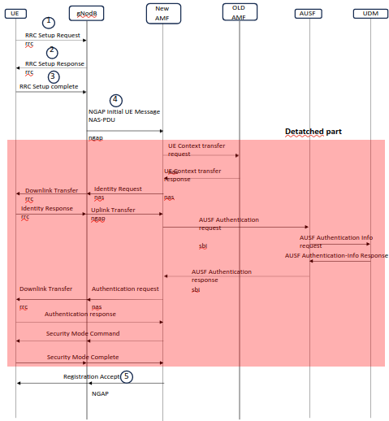

## Overview
In a typical 5G network, User Equipment (UE) performs an initial registration with the 5G core network to gain access. This project modifies the traditional UE authentication process by decentralizing it. The aim is to intercept the registration process and customize the system’s response by altering the authentication mechanism.

## Registration Call Flow
The registration call flow for a new UE follows standard procedures, as demonstrated in the following resources:
- [Registration Signal Messages](https://www.eventhelix.com/5G/standalone-access-registration/details/5g-standalone-access-registration.pdf) 
- [Registration Call flow](https://www.eventhelix.com/5g/standalone-access-registration/5g-standalone-access-registration.pdf).
 
## Project Modification
To decentralize authentication, we introduce the following changes:
1. **Interception of UE Registration Request:**
    - We intercept the system at the point where it receives the Registration Request from the UE, as part of the core 5G network services.
    - The diagram below better illustrates that:
        
        

    - This required identifying the function that handles the initial message from the UE, which encapsulates the registration request. The function handling the initial UE message is located in the file:[Message Handler](ngap-handler.c)
    - The logic for sending the new message is implemented in:[Ngap_Handler](ngap-handler.c)

2. **Creation of a New NGAP Registration Accept Message:**
    - After intercepting the registration request, we create a new NGAP message to send back to the gNodeB (gNB). This message serves as a Registration Accept response.
    - The creation of the new message involved:
        + Definining a new message structure for the NGAP Registration Accept Message in:[NGAP-NGREgistration Accept Message](../../lib/asn1c/ngap/NGAP_NGRegistrationAccept.c)
        + Creating a New IE container to hold the information elements required for the registration accept message in:[IE protocol container](../../lib/asn1c/ngap/NGAP_ProtocolIE-Container.h)

3. **Sending of new message:[Sending Registration Accept message]**
    - Once the new Registration Accept message is constructed, it is forwarded to the UE through the gNB.
    - The logic for sending the new message is implemented in:[Ngap_Handler](ngap-handler.c)

## Results 
As of now, the message is sent to the gNodeB. What remains is to send a confirmation to the AMF and forward the response to the UE.

